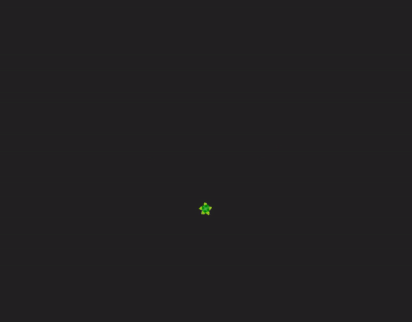

# turtle.lua for LÖVE
Minimalist **[turtle graphics](https://docs.python.org/3/library/turtle.html#module-turtle)** implementation in lua 

### What is turtle?
As docs.python introduces:
> Turtle graphics is a popular way for introducing programming to kids. It was part of the original Logo programming language developed by Wally Feurzeig, Seymour Papert and Cynthia Solomon in 1967.

> Imagine a robotic turtle starting at (0, 0) in the x-y plane. After an import turtle, give it the command turtle.forward(15), and it moves (on-screen!) 15 pixels in the direction it is facing, drawing a line as it moves. Give it the command turtle.right(25), and it rotates in-place 25 degrees clockwise.

> By combining together these and similar commands, intricate shapes and pictures can easily be drawn.

<br> 

<p float="left">
  
   
</p>

# Turtle Methods

## 1. Turtle motion
  * Move and draw

  ```lua
   forward() | fd()  
   backward() | bk() | back()
   right() | rt()
   left() | lt()
   tl()
   rt()
   setheading() | seth()
   home()
   go_to() | go() | setpos() | setposition()
   setx()
   sety()
   undo()
   speed()
```
  * Turtle's state
```lua
   position()
   heading()
   distance()
   name()
   print()
```

## 2. Pen control
  * Drawing state
  ```lua
   pendown() | pd() | down()
   penup() | pu() | up()
   pensize() | width()
   isdown()
  ```
  * Color control
  ```lua
   color()
  ```
  * Drawing control
  ```lua 
   reset()
   clear()
  ```

## 3. Turtle state
  * Visibility
  ```lua
   showturtle() | st()
   hideturtle() | ht()
   isvisible()
```
  * Color
  ```lua
   turtlecolor() | tc()
  ```
## 4. Event

```lua 
 ondrawfinish() 
```
## 5. Animation

```lua
 play()
 pause()
 toggle()
  
```

# Quick example
```lua
local line = Turtle()
local circle = Turtle(100,100,1)
local rectangle = Turtle(100,150,1, {1, 1, 1})

function love.load()
    local red = {1, 0, 0}
    line:clear():right(35):forward(100)
    circle:setcolor(1,1,1):penup()
    for i=1, 360 do
        circle:pendown():right(1):forward(2)
    end
    triangle:setcolor(red):left(60):forward(50):right(120):forward(50):left(60):backward(50)
end

function love.draw()
    line:draw()
    circle:draw()
    rectangle:draw()
end


```

License 
=======
 
> Copyright (c) 2020 Erkam Badın
> 
> Permission is hereby granted, free of charge, to any person obtaining a copy
> of this software and associated documentation files (the "Software"), to deal
> in the Software without restriction, including without limitation the rights
> to use, copy, modify, merge, publish, distribute, sublicense, and/or sell
> copies of the Software, and to permit persons to whom the Software is
> furnished to do so, subject to the following conditions:
> 
>
> Except as contained in this notice, the name(s) of the above copyright holders
> shall not be used in advertising or otherwise to promote the sale, use or
> other dealings in this Software without prior written authorization.
> 
> THE SOFTWARE IS PROVIDED "AS IS", WITHOUT WARRANTY OF ANY KIND, EXPRESS OR
> IMPLIED, INCLUDING BUT NOT LIMITED TO THE WARRANTIES OF MERCHANTABILITY,
> FITNESS FOR A PARTICULAR PURPOSE AND NONINFRINGEMENT. IN NO EVENT SHALL THE
> AUTHORS OR COPYRIGHT HOLDERS BE LIABLE FOR ANY CLAIM, DAMAGES OR OTHER
> LIABILITY, WHETHER IN AN ACTION OF CONTRACT, TORT OR OTHERWISE, ARISING FROM,
> OUT OF OR IN CONNECTION WITH THE SOFTWARE OR THE USE OR OTHER DEALINGS IN THE
> SOFTWARE.
